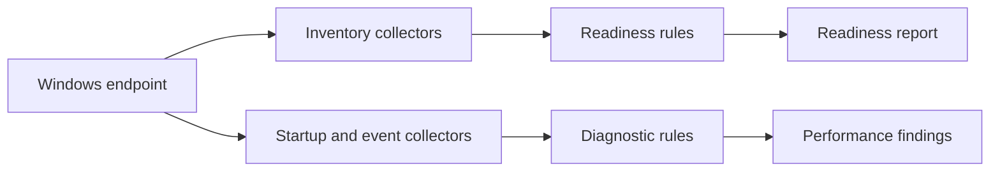

# Architecture

## Two-dimensional line map

```text
                              ANALYSIS DIMENSION
               DISCOVER -------- DIAGNOSE -------- DECIDE
                  |                  |                |
Hardware ------> Inventory -------- Capacity ------- Readiness
                  |                  |                |
Startup -------> Tasks/Apps ------- Delay ---------- Review
                  |                  |                |
Operating Sys -> Version/State ---- Compatibility -- Action
                  |                  |                |
Performance ---> Events/Resources - Correlation ---- Recommendation

METAFIELD AXIS: Purpose | Input | Rule | Evidence | Output | Risk
```

## Component architecture



## Design safeguards

- Diagnosis precedes remediation.
- Critical thresholds are evaluated before lower thresholds.
- Device type and business workload should inform recommendations.
- Raw hardware identifiers and user paths are excluded from public reports.
